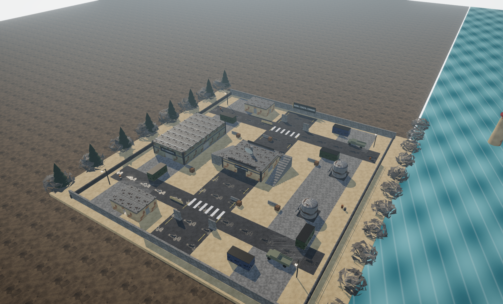
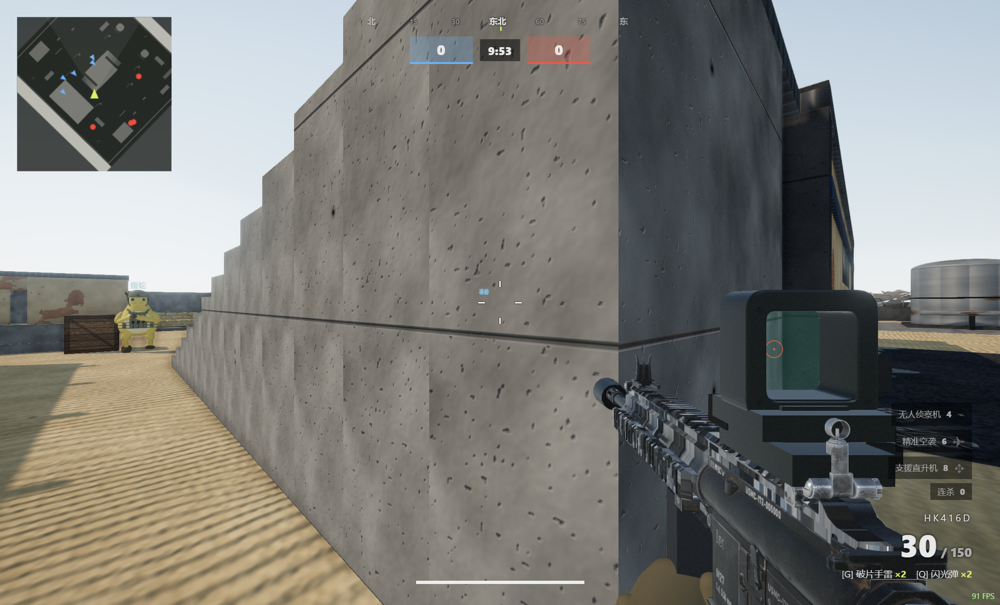

# 奶蛙召唤 · CALL OF NAIWA

离线 Windows FPS 游戏，基于 Three.js 与 Electron。当前版本 **2.2.0**。



## 游戏内容

- 黄色战术奶蛙角色，头盔、战术背心与 HK416D。
- 原创地图「海岸前哨」：雷达站、可登顶平台、物流仓库、海岸侧翼。已移除工厂地图。
- 团队死斗、据点占领、自由混战，以及前哨突袭战役。
- HK416D 换弹动画：取匣、插匣、回握，空仓时释放枪机；包含弹药结算与打断复位。
- 五种瞄具、滑铲开镜射击、滑铲接跳跃与增强机动性。
- 18 种连杀奖励，英文男性电台播报，中文界面。
- 实时阴影、SSAO、环境反射和程序化材质。



## 开发运行

在 Windows 上安装 Node.js 与 npm，然后执行：

```sh
npm ci
npm start
```

游戏素材和播报随源码提供。首次安装开发依赖需要网络，游戏运行无需联网。当前为离线 AI 对战，不包含真人联机服务器。

## 生成 Windows EXE

```sh
npm run package
```

输出目录为 `dist/奶蛙召唤/`。分发时复制整个目录，包括 EXE、resources、locales 和 DLL。可用 `ELECTRON_RUNTIME` 指定已有的 Windows Electron 运行时，`NAIWA_OUTPUT_DIR` 指定打包目录。

## 操作

WASD 移动；左键射击；右键开镜；R 换弹；Shift 冲刺；C / Ctrl 蹲伏或滑铲；空格跳跃；G / Q 投掷物；F 互动；3 / 4 / 5 连杀奖励；Esc 暂停；F11 全屏。

详细说明见 [使用说明](使用说明.md) 与 [连杀奖励对照](连杀奖励对照.md)。

## 检查

使用独立存档启动测试实例：

```powershell
$env:MELLOW_QA='1'
$env:MELLOW_CDP_PORT='9333'
$env:MELLOW_USER_DATA=Join-Path $PWD 'test-profile'
npm start
```

保持窗口运行，在另一终端执行 `npm test`。测试会操作游戏；结果保存至忽略的 `test-results/` 目录。正式运行时不要设置 `MELLOW_QA`。最终 EXE 的 `test/package.mjs` 使用端口 9334 和独立新存档。

## 主要代码

| 路径 | 内容 |
|---|---|
| `app/js/outpost.js` | 原创地图 |
| `app/js/outpost-campaign.js` | 前哨突袭战役 |
| `app/js/hk416.js` | HK416D 导入与弹匣分离 |
| `app/js/reload-animation.js` | 换弹动作 |
| `app/js/optics.js` | 瞄具 |
| `app/js/streak-system.js` | 连杀奖励 |
| `desktop/` | Windows 桌面封装与打包 |

## 来源与许可

基于 [zty828/OPUS5.5-COD](https://github.com/zty828/OPUS5.5-COD) 改编。第三方模型、语音和依赖各自适用其来源条件；本仓库不为第三方素材另行授予许可。语音模型卡标注 CC BY-NC-SA 4.0，相关说明保留在 [素材与来源](素材与来源.md) 和素材目录中。Three.js 许可见 [THREE-LICENSE.txt](THREE-LICENSE.txt)。
